# Store Teacher Settings in Flashcard Progress Assignment Description

## Current State

- **course_settings** (Postgres): `selectedCurriculums`, `selectedUnits`, `progressAssignmentId`, `canvasApiToken`
- **Flashcard Progress** assignment: Fixed description, used for student progress submissions (comments)
- **Students**: Fetch `course-settings` + `all-playlists`, then filter client-side

## Target Architecture

```mermaid
flowchart TB
    subgraph TeacherSave [Teacher Save]
        TS[TeacherSettings] --> Modal[Show modal: configuring decks takes 30-60 sec]
        Modal --> PUT[PUT /api/course-settings]
        PUT --> CS[CourseSettingsService]
        CS --> Sprout[Fetch playlists with videos]
        Sprout --> Filter[Filter by curriculum/units]
        Filter --> Videos[Fetch title and embed per video]
        Videos --> Paste[Copy full data into assignment]
        Paste --> Canvas[Canvas API]
        Canvas --> AD[Assignment description]
        AD --> CloseModal[Close modal]
    end
    
    subgraph StudentLoad [Student Load]
        FL[FlashcardsPage] --> GET[GET /api/course-settings]
        GET --> Fetch[Fetch assignment from Canvas]
        Fetch --> Parse[Parse description]
        Parse --> Cached[Cached playlists with full video details]
        Cached --> FL
        FL --> OpenDeck[Open deck]
        OpenDeck --> Instant[Instant load - no API calls]
        Instant --> FL
    end
```



## 1. Slim Down course_settings and Add Assignment Description Storage

**course_settings** (keep minimal):

- `course_id`, `progress_assignment_id`, `canvas_api_token`, `updated_at`
- Remove: `selected_curriculums`, `selected_units` (migrated to assignment description)

**Assignment description JSON structure** (stored in Flashcard Progress assignment):

```json
{
  "v": 1,
  "selectedCurriculums": ["TWA"],
  "selectedUnits": ["05", "06", "07", "08"],
  "filteredPlaylists": [
    {
      "id": "abc",
      "title": "TWA.05.01",
      "items": [
        { "title": "Vocabulary Item 1", "embed": "<iframe ...>" },
        { "title": "Vocabulary Item 2", "embed": "<iframe ...>" }
      ]
    }
  ],
  "updatedAt": "2025-02-21T...",
  "playlistUpdatedAt": { "abc": "2025-02-15T...", "def": "2025-02-10T..." }
}
```

- `filteredPlaylists`: Full playlist data — each playlist includes `items` array with `{ title, embed }` per video
- On save: fetch playlists (one call) + fetch title/embed per video in filtered playlists — takes 30–60 sec; modal alerts teacher
- When student opens deck: instant — use cached `items`; no API calls

**Files**:

- [apps/api/src/canvas/canvas.service.ts](apps/api/src/canvas/canvas.service.ts): Add `getAssignment(courseId, assignmentId)` and `updateAssignmentDescription(courseId, assignmentId, description, tokenOverride)`
- [apps/api/src/course-settings/course-settings.service.ts](apps/api/src/course-settings/course-settings.service.ts): On save, fetch playlists, filter, fetch full video details (title, embed) per video in filtered playlists, paste into assignment. Read from assignment description instead of DB for curriculum/units/playlists
- Migration: Remove `selected_curriculums`, `selected_units` from course_settings (or leave columns for backward compat and stop using them)

## 2. Save: Fetch Full Video Details (Modal for Teacher)

When teacher saves:

1. **Show modal/alert**: "Configuring decks for best student experience... This may take 30–60 seconds." (or similar) — so teacher knows to wait
2. Fetch playlists — `fetchAllPlaylists()` (one call with order_by=updated_at)
3. Filter by curriculum/units (same logic as TeacherSettings)
4. **For each filtered playlist**: fetch title and embed per video (reuse `getPlaylistItems(playlistId)` — fetches each video via `GET /v1/videos/{id}`)
5. Build `filteredPlaylists` with `items: [{ title, embed }]` per playlist
6. Update assignment description via Canvas API
7. Upsert course_settings
8. Close modal on success (or show error)

**SproutVideoService** ([apps/api/src/sproutvideo/sproutvideo.service.ts](apps/api/src/sproutvideo/sproutvideo.service.ts)):

- Modify `fetchAllPlaylists()` to use `order_by=updated_at&order_dir=desc` and return `videos`, `updated_at`
- Existing `getPlaylistItems(playlistId)` already fetches title + embed per video — use for filtered playlists

**CourseSettingsService.save** flow:

1. Ensure Flashcard Progress assignment exists
2. Fetch playlists (one call) → filter
3. For each filtered playlist: call `getPlaylistItems('', playlistId)` → get `{ title, embed }[]`
4. Build JSON with `selectedCurriculums`, `selectedUnits`, `filteredPlaylists` (id, title, items), `playlistUpdatedAt`
5. Update assignment description via Canvas API
6. Upsert course_settings

## 3. Read Settings from Assignment Description

**GET /api/course-settings**:

1. Resolve `progressAssignmentId` from course_settings (or find by name "Flashcard Progress")
2. Fetch assignment from Canvas: `GET /api/v1/courses/:id/assignments/:id`
3. Parse `description` as JSON
4. Return `{ selectedCurriculums, selectedUnits, filteredPlaylists, hasCanvasToken }`
5. If description is empty/invalid: return null (first-time or legacy)

**CourseSettingsService.get**:

- Read from assignment description when `progressAssignmentId` exists
- Fallback: if no assignment or parse fails, return null

## 4. SproutVideo Update Check on Teacher Load

**Flow**:

1. When TeacherSettings loads (or teacher opens LTI tool): call new endpoint `GET /api/course-settings/needs-update?course_id=...`
2. Backend: fetch assignment description, get `playlistUpdatedAt`
3. Backend: SproutVideo call with `order_by=updated_at&order_dir=desc` — playlists return newest-first
4. **Early exit**: Stop paginating once all playlists in a page are older than the newest cached `updated_at` — typically 1 page instead of many (makes syncing much faster)
5. Compare: for each cached playlist ID, if SproutVideo `updated_at` > cached `updated_at` → stale
6. Return `{ needsUpdate: boolean }`
7. Frontend: if `needsUpdate`, show "Update playlists" button

**Alternative simpler approach**: Include update check in existing `GET /api/course-settings`. Same logic, add `needsUpdate` to response when teacher.

**Files**:

- [apps/api/src/sproutvideo/sproutvideo.service.ts](apps/api/src/sproutvideo/sproutvideo.service.ts): Add `order_by=updated_at&order_dir=desc` to fetch URL; return `videos` and `updated_at`
- [apps/api/src/course-settings/course-settings.service.ts](apps/api/src/course-settings/course-settings.service.ts): Add `checkNeedsUpdate(courseId)` — use order_by=updated_at desc, stop paginating when all playlists older than cached min
- [apps/api/src/course-settings/course-settings.controller.ts](apps/api/src/course-settings/course-settings.controller.ts): Add `GET needs-update` or extend GET response with `needsUpdate`
- [apps/web/src/components/TeacherSettings.tsx](apps/web/src/components/TeacherSettings.tsx): Modal on save: "Configuring decks... may take 30–60 sec"; on load, if `needsUpdate` show "Update playlists" button. On click, call PUT to re-save (triggers full refresh)

## 5. Student Path: Instant Deck Open (Cached Full Data)

**FlashcardsPage** ([apps/web/src/pages/FlashcardsPage.tsx](apps/web/src/pages/FlashcardsPage.tsx)):

- `loadHubData`: Use `filteredPlaylists` from `GET /api/course-settings` — no `all-playlists` fetch, no client-side filtering
- When student opens a deck: use cached `items` (title, embed) directly — **instant load, no API calls**

## 6. Migration Strategy

- **Phase 1**: Add assignment description write on save; keep reading from course_settings for curriculum/units (dual-write)
- **Phase 2**: Change GET to read from assignment description first; fallback to course_settings if description empty
- **Phase 3**: Migration to drop `selected_curriculums`, `selected_units` from course_settings (optional)

## Key Files Summary

| File | Changes |
|------|---------|
| [apps/api/src/canvas/canvas.service.ts](apps/api/src/canvas/canvas.service.ts) | Add `getAssignment`, `updateAssignmentDescription` |
| [apps/api/src/sproutvideo/sproutvideo.service.ts](apps/api/src/sproutvideo/sproutvideo.service.ts) | Add `order_by=updated_at&order_dir=desc` to fetch URL; return `videos` and `updated_at` |
| [apps/api/src/course-settings/course-settings.service.ts](apps/api/src/course-settings/course-settings.service.ts) | Save: fetch playlists + full video details per filtered playlist, paste into assignment; Get: read from assignment; Add `checkNeedsUpdate` |
| [apps/api/src/course-settings/course-settings.controller.ts](apps/api/src/course-settings/course-settings.controller.ts) | Extend GET to include `needsUpdate` when teacher |
| [apps/web/src/components/TeacherSettings.tsx](apps/web/src/components/TeacherSettings.tsx) | Modal on save: "Configuring decks... may take 30–60 sec"; "Update playlists" button when needsUpdate; on click re-save |
| [apps/web/src/pages/FlashcardsPage.tsx](apps/web/src/pages/FlashcardsPage.tsx) | Use `filteredPlaylists` from course-settings; instant deck open from cached `items` |
| Migration | Slim course_settings (optional, can defer) |

## Notes

- Teacher save takes 30–60 seconds (fetch playlists + title/embed per video). Modal/alert informs teacher.
- `order_by=updated_at&order_dir=desc` (verified) — playlists return newest-first; staleness check can stop paginating early.
- Student deck open: instant — use cached `items` (title, embed); no SproutVideo calls.
- `canvas_api_token` and `progress_assignment_id` remain in course_settings.
