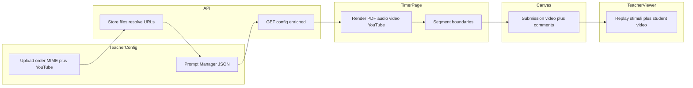

# Plan: PDF, audio, video files, and YouTube prompts (GoReact-style stimuli)

## Current baseline (what you extend)

- **Teacher config** persists in the Canvas “Prompt Manager Settings” JSON via [`PromptConfigJson`](apps/api/src/prompt/dto/prompt-config.dto.ts): `promptMode?: 'text' | 'decks'`, `prompts[]` for HTML-ish text, `videoPromptConfig` for Sprout deck mode.
- **Student recording** in [`TimerPage.tsx`](apps/web/src/pages/TimerPage.tsx): deck mode uses `POST /api/prompt/build-deck-prompts`, then treats prompts as strings for display; boundaries go to `deckTimeline` on submit (see [`promptApi`](apps/web/src/api/prompt.api.ts) / upload path).
- **Viewer** in [`TeacherViewerPage.tsx`](apps/web/src/pages/TeacherViewerPage.tsx): resolves `deckTimeline` from submission body/comments and aligns rubric/active item.

New file-based prompts should mirror that pattern: **ordered stimulus list + per-item timing + durable references** so grading can replay “what the student saw.”

## Product / architecture decisions (do these first)

1. **Stimulus storage (drives cost and security)**  
   - **Option A (Canvas-native):** Teacher uploads assets via Canvas Files (or assignment-scoped upload) using existing [`CanvasService`](apps/api/src/canvas/canvas.service.ts) patterns (similar mental model to student video upload). Pros: one trust domain, existing OAuth. Cons: API surface area, URL stability, CORS/proxy needs for LTI iframe.  
   - **Option B (app storage):** S3/GCS + signed URLs. Pros: simpler MIME pipeline. Cons: new infra, retention, DPA, backup story.

2. **Prompt mode shape**  
   - Add a **third `promptMode`** (e.g. `file_sequence` / `media`) rather than overloading `decks` (Sprout-specific).  
   - Config schema: ordered array of `{ kind: 'pdf'|'audio'|'video'|'youtube'; label?: string; durationSec?: number; ref?: CanvasFileRef | StoredAssetRef; youtubeVideoId?: string; clipStartSec?: number; clipEndSec?: number }` (exact names TBD). **Persist only a normalized `youtubeVideoId`** (never raw teacher HTML) so the tool always renders a known-good `iframe` `src`. For **YouTube**, prefer **explicit clip window** (`clipStartSec` & `clipEndSec`, with `start < end`) over a lone `durationSec`—the segment length is `end − start`, matching how YouTube **Clips** and embed **`start` / `end` query params** bound playback. Reuse the **timing model** from deck (floor + transition) for non-YouTube items, or fixed windows where duration cannot be inferred (PDF, audio).

### YouTube (very common — scoped add-on)

- **Teacher input (flexible UX):** Accept either (a) a normal watch URL (`youtube.com/watch?v=…`, `youtu.be/…`, shorts URLs if you choose to support them), or (b) pasted **embed code** (`<iframe src="https://www.youtube.com/embed/VIDEO_ID?…">`). Strip whitespace; reject if multiple video IDs detected.
- **Normalization (server-side on `putConfig` and optionally client preview):** Parse to a single **11-character video id** (or documented rules for shorts); build canonical embed URL for display, e.g. `https://www.youtube-nocookie.com/embed/VIDEO_ID` with conservative query params (`rel=0`, etc.) as product policy dictates. **Append `start` and `end` (seconds, integers)** from the teacher’s clip bounds so the iframe matches a bounded segment (same idea as sharing a [YouTube Clip](https://support.google.com/youtube/answer/10703217?hl=en)—whether or not you parse official `youtube.com/clip/…` share URLs in v1, the persisted config should always resolve to `videoId` + `clipStartSec` + `clipEndSec`).
- **Migration from current YouTube-only mode:** Today’s [`YoutubePromptConfig`](apps/api/src/prompt/dto/prompt-config.dto.ts) uses `durationSec` (“stimulus duration”). When implementing Timer + full YouTube stimulus, **replace that with start/end** (e.g. default `clipStartSec: 0`, `clipEndSec: clipStartSec + durationSec` once for migration, then drop `durationSec` from the teacher UI). Student Timer and TeacherViewer should key off **clip end** for auto-advance, not a separate ambiguous duration field.
- **Display in LTI:** Render stimulus with `<iframe title="…" allow="accelerometer; autoplay; clipboard-write; encrypted-media; gyroscope; picture-in-picture; web-share" allowfullscreen>` (exact `allow` list per YouTube’s current guidance). **Student recorder** remains separate from this iframe (same constraint as file `video` prompts).
- **CSP / hosting:** Ensure the web app’s Content-Security-Policy **`frame-src`** (or `frame-ancestors` only where relevant) allows `https://www.youtube-nocookie.com` and/or `https://www.youtube.com` wherever the tool is framed (Canvas, local dev). This is a common “works in dev, blocked in Canvas” failure mode — add an explicit checklist item in Phase 5.
- **Timeline / grading:** Store `youtubeVideoId`, **`clipStartSec` / `clipEndSec`**, and optional `label` in the same ordered timeline structure as file assets so [`TeacherViewerPage`](apps/web/src/pages/TeacherViewerPage.tsx) can replay the active stimulus at the playhead (embed with same `start`/`end`) and teachers can open full-size in a modal if desired (pattern like [`SproutSourceCardModal`](apps/web/src/components/SproutSourceCardModal.tsx)).
- **Risks:** Some videos disallow embedding; age-restricted or login-only content fails in iframe — surface a **teacher-side preview** on save and a **student-safe fallback message** when the player errors. YouTube ToS / institutional policy is a program-level decision (document, do not solve in code).

3. **Student UX while recording**  
   - Define layout: stacked stimulus + camera, PiP, or tabbed (GoReact-like is often split/stack). Video stimulus must not steal the only `<video>` element used for the student recorder (likely **two video elements** or stimulus in iframe).

4. **Submission artifact**  
   - Extend or parallel `deckTimeline` (e.g. `mediaTimeline`) in the same JSON comment post-upload path so Canvas body replacement does not lose data (same lesson as current `deckTimeline` in comments).

## Implementation phases (files and scope)

### Phase 1 — Schema, validation, persistence (API + shared types)

- Extend [`prompt-config.dto.ts`](apps/api/src/prompt/dto/prompt-config.dto.ts) + [`prompt.api.ts`](apps/web/src/api/prompt.api.ts) `PromptConfig` with new mode and `filePromptConfig` (name TBD).
- [`putConfig` / `getConfig`](apps/api/src/prompt/prompt.service.ts): validate MIME allowlist (`application/pdf`, `audio/*`, `video/*`), max file size, max count, total duration caps; **validate and normalize YouTube** entries (reject unknown hosts, empty id, playlists if you want playlist items out of scope for v1).
- **Persistence:** either Canvas file IDs in blob + server-side “resolve to playback URL” on GET config, or signed URLs regenerated each launch.

**Estimate:** 4–7 person-days (longer if Canvas file upload UX is new).

### Phase 2 — Teacher upload and ordering UI

- [`TeacherConfigPage.tsx`](apps/web/src/pages/TeacherConfigPage.tsx): new section when `promptMode === <new>`: upload, reorder (drag/drop), per-item label/duration, remove, preview; **YouTube row:** single text area or field for “URL or embed code”, preview iframe after blur/submit, show normalized id. For **YouTube-only / first-class YouTube stimulus**, pair **clip start** and **clip end** (time inputs or sliders against duration if known)—**remove** the old single-field “stimulus duration” / `durationSec` UX once clip bounds land.
- New API endpoints (e.g. `POST /api/prompt/prompt-assets` multipart + `DELETE`) or Canvas-only flow from browser with server brokering.

**Estimate:** 5–8 person-days (upload progress, error states, accessibility).

### Phase 3 — Student recording (`TimerPage`)

- Load config; build ordered timeline (server or client).
- **PDF:** embed via `<iframe>` to a **proxied** PDF URL (CSP + Canvas auth) or PDF.js in-app (more work, better control).
- **Audio:** `<audio controls>` with controlled advance (auto-next vs teacher “fixed duration”).
- **Video:** `<video>` for stimulus separate from `MediaRecorder` camera pipeline; handle autoplay policies (muted preview, user gesture).  
- **YouTube:** `<iframe>` only (no `youtube.com` navigation in top window); **`src` includes `start` & `end`** from config so playback **stops at the clip end** (teacher-set segment, not a separate “prompt duration” knob). If you need polish beyond iframe params (e.g. scrub guard), add **IFrame Player API** behind a feature flag—still driven by the same `clipStartSec`/`clipEndSec`.
- Reuse deck-style **phase machine** where possible: advance when the clip segment ends (`clipEndSec − clipStartSec` wall-clock or player `onStateChange` if using API), record segment boundaries into `mediaTimeline` (same shape idea as [`DeckTimelineEntry`](apps/web/src/pages/TeacherViewerPage.tsx)).
- Wire [`doSubmit`](apps/web/src/pages/TimerPage.tsx) / [`prompt.service` upload path](apps/api/src/prompt/prompt.service.ts) to attach timeline JSON to submission comments like deck mode.

**Estimate:** 8–14 person-days (largest variance: PDF + dual-video + edge cases on browsers).

### Phase 4 — Viewer / grading

- [`TeacherViewerPage.tsx`](apps/web/src/pages/TeacherViewerPage.tsx): parse `mediaTimeline` (or extended deck timeline with `kind`); active panel shows correct renderer; optional “open stimulus” like existing Sprout modal pattern ([`SproutSourceCardModal`](apps/web/src/components/SproutSourceCardModal.tsx)).
- **Proxy / auth:** reuse or extend [`GET video-proxy`](apps/api/src/prompt/prompt.controller.ts) pattern for non-Instructure hosts if assets are Canvas URLs requiring same protections. **YouTube** does not go through your video proxy; it is embedded directly once CSP allows it.

**Estimate:** 5–8 person-days.

### Phase 5 — Hardening (replacement-grade)

- Quotas, virus scanning policy (at minimum MIME + size + server-side magic-byte check), rate limits.
- Mobile Safari recording + PDF performance; offline partial failure; teacher edit/replace asset (versioning).
- Documentation for chairs (`AGENTS.md` / teacher help), feature flag, staged rollout.
- Automated tests where feasible (DTO validation, timeline merge); manual matrix on Chrome/Safari/Firefox.
- **CSP checklist:** `frame-src` for YouTube domains in all deploy environments (including Canvas-hosted LTI).

**Estimate:** 6–10 person-days.

## Rough total timeline

| Band | Calendar (1 engineer) | Notes |
|------|------------------------|--------|
| **Lean** | ~5–6 weeks | Canvas file refs already well understood; simple PDF iframe; minimal teacher UI |
| **Realistic** | ~7–10 weeks | Robust uploads, proxy/CORS, PDF edge cases, dual-video UX, full viewer parity |
| **With review + QA buffer** | ~10–14 weeks | Includes polish for “replace GoReact” expectations and production hardening |

Parallelizing (second engineer on web vs API) can compress calendar time roughly **30–40%** after Phase 1 decisions are locked.

## Risks to call out for your chair

- **Canvas + LTI constraints** (tokens, file visibility, student vs teacher actor on upload) often dominate schedule; early spike on “teacher uploads file, student fetches in LTI iframe” is high leverage.
- **PDF and autoplay** are the usual source of browser-specific bugs; budget time explicitly.
- **IP / FERPA:** storing prompts on third-party blob vs Canvas may matter for institutional approval.
- **YouTube:** embed-disabled or restricted videos; reliance on Google’s player inside your product.

## Suggested next step before coding

- Time-boxed **spike (2–3 days):** one PDF + one audio + one short video **+ one YouTube URL and one pasted embed** end-to-end with chosen storage option, no full TeacherConfig polish, to validate Canvas URLs, **CSP in Canvas iframe**, and TimerPage layout (dual video + YouTube iframe).
