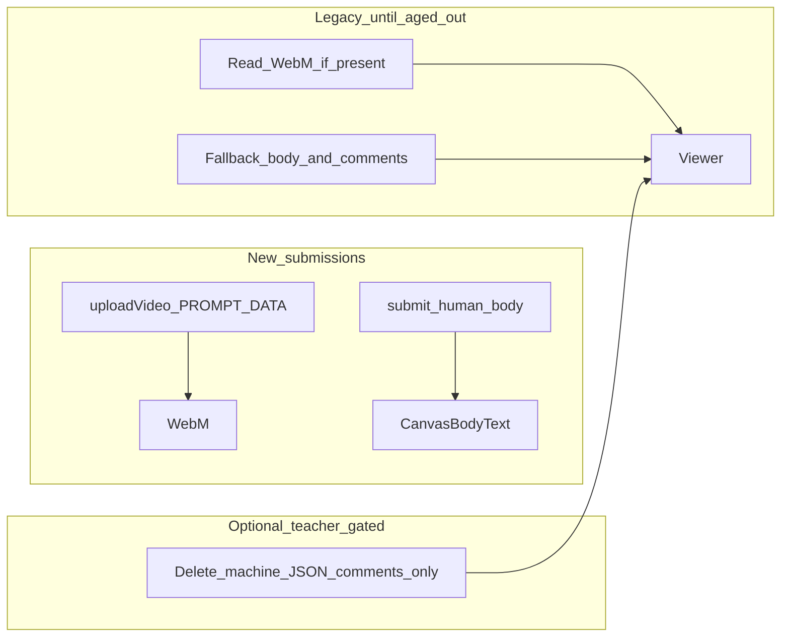

# Prompt storage (revised): no video file replacement

**Supersedes:** any plan that relied on downloading student WebMs, remuxing `PROMPT_DATA`, and re-uploading / replacing Canvas submission files with a teacher token (known 403; no admin `as_user_id`).

## Constraints (non-negotiable)

- **Never** replace or re-upload student submission video files with a teacher token.
- **Legacy** prompt-in-body and prompt-in-comment shapes must keep working **indefinitely** via fallback readers until those submissions age out naturally.

## A. New submissions (forward path)

- **Already correct:** prompt data muxed into WebM `PROMPT_DATA` on upload ([`uploadVideo`](../../apps/api/src/prompt/prompt.service.ts)).
- **Server `submit`:** stop writing **machine JSON** to the submission body (`deckTimeline` / `promptSnapshotHtml` blobs). Write only a **human-readable** prompt summary plus short guidance to use Canvas SpeedGrader for full rubric/video context (ordered list for decks, plain text for text prompts).
- **Comments:** do **not** add machine prompt JSON to submission comments for new flows; keep normal teacher feedback (`[mm:ss] …`) as today.

## B. Grading / viewer resolution (new + legacy)

- **Primary:** read from WebM `PROMPT_DATA` when the tag is present and valid.
- **Unified resolution chain (server is canonical):** [`resolvePromptRowFromWebmMetadata`](../../apps/api/src/prompt/prompt.service.ts) must apply **the same ordered sources for `promptHtml` and duration** regardless of where the prompt was originally stored:
  1. **WebM metadata** (full or partial fields, with gaps filled from the next layers).
  2. **Submission body** (legacy JSON: `promptSnapshotHtml`, `deckTimeline`, `durationSeconds`, etc.).
  3. **Submission comments** (same JSON shapes and the same legacy heuristics as the client: forward scan for JSON prompt/deck, then “Prompt used:” / markup tail—aligned with [`TeacherViewerPage.tsx`](../../apps/web/src/pages/TeacherViewerPage.tsx) `getPromptFromComments` / latest-comment duration+deck hints).
- **Client:** keep **`getPromptFromComments`**, **`parseDeckTimelineFromSubmissionComments`**, **`resolveDeckTimeline`**, and body-based deck parsing as **defensive fallback** only; **`mediaStimulus`** is resolved on the server (WebM → body → comments) and returned on submission DTOs.

## C. Legacy submissions — no video mutation

- **No** migration step that muxes or uploads a new file.
- **No** `putSubmissionOnlineUploadFileIds` / file-replace path for “migration.”

## D. Student-visible noise — comment-only cleanup (optional, teacher-gated)

**Problem:** machine JSON in **submission comments** is student-visible noise.

**Allowed action:** delete **only** comments that are clearly **machine prompt JSON** (e.g. `fsaslKind`, `deckTimeline`, `promptSnapshotHtml` in JSON), and **never** delete `[mm:ss]` teacher feedback.

**Required flow**

1. **Status** for the selected submission: what exists (WebM metadata yes/no, legacy body yes/no, comment ids that look like machine JSON).
2. **Precondition to offer delete:** teacher can confirm the viewer still shows the prompt **without** those comments—typically **legacy JSON still on submission body** for fallback, or metadata alone suffices. API + UI copy must state this.
3. **Confirm + delete:** explicit teacher action (e.g. `teacherConfirmed: true`). **Never** automatic; **never** mass job on import.

**Optional follow-up:** rewriting legacy body to human-readable text is not required for comment cleanup if body already holds the JSON fallback.

## E. Import flow

- **Non-blocking CTA** only (e.g. review legacy prompt comments in grading viewer)—**no** auto cleanup, **no** mux.

## F. Repo alignment if mux-migration was partially implemented

- **Remove** endpoints/service/UI that remux, re-upload, or post-upload verify replaced files.
- **Restore** server body/comment fallbacks and client legacy parsers if they were removed or narrowed to metadata-only.
- **Keep** human-readable `submit` body and shared formatter where they match section A.

## Summary

## Implementation todos

1. **Done:** No mux/re-upload migration in repo; metadata + body + comment resolution + client fallbacks aligned with sections B/C/F.
2. **Done:** Server-side comment parsing in `resolvePromptRowFromWebmMetadata` (metadata → body → comments); client parsers remain fallback-only.
3. **Done:** Forward path: `submit` writes human-readable body only (`submission-human-readable-body.util.ts`); upload keeps `PROMPT_DATA` mux only; no new machine JSON in comments (existing code paths already avoided student prompt JSON comments on upload).
4. **Done:** Teacher-gated machine-prompt comment cleanup: `GET /api/prompt/grading/machine-prompt-comments/status`, `POST .../delete` with `teacherConfirmed`; TeacherViewer panel + preconditions.
5. **Done:** Import success copy in Teacher Config: non-blocking hint only (no auto cleanup / mux).
