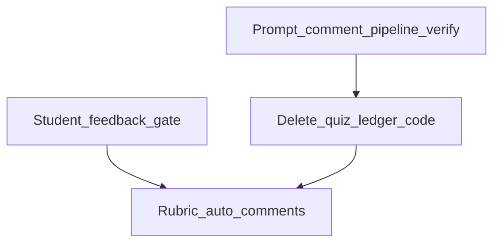

# Prompter fixes: deprecated Canvas objects, student feedback, prompt comments, rubric comments

## Priority order (your stack rank)

1. **Remove quiz/ledger + verify prompt recovery from submission comments** — one shippable slice: verify/fix submit + upload so prompts remain recoverable from **comments (and standard submission fields)**, **then** remove every quiz/ledger code path (no feature flag, no runtime fallback).
2. **Student access to feedback** when multiple submissions are allowed (chooser + single-attempt auto-viewer).
3. **Rubric criterion feedback** — keep full existing teacher grading viewer (especially rubric); only change is **Prompt:** prefix + append teacher notes; restore prefix when feedback is cleared.
4. **Unlimited attempts** (`-1`) **+ Sprout reference** (link-styled rubric prompt → modal during playback) in teacher and student feedback UIs.

---

## 1) Stop deprecated quiz + ledger-style Canvas churn (critical)

### What the code does today (so we remove the right calls)

| Mechanism | Where | Purpose (legacy) |
|-----------|--------|-------------------|
| **Prompt storage quiz** | [`QuizService.ensurePromptStorageQuiz`](apps/api/src/quiz/quiz.service.ts) — one quiz per course titled `ASL Express Prompt Storage`; `quiz_type: 'assignment'` | Old channel to store which prompt a student saw |
| **One essay question per prompter assignment** | [`ensureQuestionForAssignment`](apps/api/src/quiz/quiz.service.ts), invoked from [`putConfig`](apps/api/src/prompt/prompt.service.ts) ~1443–1448 | Adds rows to that quiz — **many assignments ⇒ many questions**, which can overwhelm Canvas quiz/assignment UIs |
| **Per-submit quiz answers** | [`submit` → `quiz.storePrompt`](apps/api/src/prompt/prompt.service.ts) ~2460–2467 | Writes prompt HTML into quiz submission for that student |
| **Prompt ledger assignment** | [`ensureLedgerAssignment`](apps/api/src/prompt/prompt.service.ts) ~510–567; **`submit` ~2424–2457** and **`getSubmissions` ~3031** | Separate Canvas assignment for append-only JSON “ledger” rows — **important:** loading the teacher submissions list can still **create** the ledger assignment if missing, which adds to assignment bloat |
| **Settings blob assignment** | [`ensurePromptManagerSettingsAssignment`](apps/api/src/prompt/prompt.service.ts) ~570–594 | Still needed for storing Prompt Manager JSON in an assignment description unless migrated |

### Decision: ledger and quiz are **deprecated and removed** (mandatory)

**Policy:** There is **no** production fallback to quiz or ledger after this work. Prompts for grading and student feedback come from **structured submission comments** (and related submission data Canvas already returns—attachments, rubric, etc.), with parsing of older shapes for backwards compatibility until data ages out. Prompt Manager **settings** remain for **teacher config**, not per-attempt prompt history.

**Code to delete (not disable):**

- **Ledger:** the write block on [`submit`](apps/api/src/prompt/prompt.service.ts) ~2418–2457; the entire read/correlate block in [`getSubmissions`](apps/api/src/prompt/prompt.service.ts) ~3029–3088; **`ensureLedgerAssignment` and any path that creates the ledger assignment**; remove **`promptLedgerAssignmentId`** from the Prompt Manager settings blob type and from all read/write/merge paths.
- **Quiz:** [`putConfig`](apps/api/src/prompt/prompt.service.ts) calls to `ensurePromptStorageQuiz` / `ensureQuestionForAssignment`; [`submit`](apps/api/src/prompt/prompt.service.ts) `storePrompt`; quiz fallbacks in `getSubmissions` ~3167–3174 and [`getMySubmission`](apps/api/src/prompt/prompt.service.ts) ~3387–3392; [`QuizController`](apps/api/src/quiz/quiz.controller.ts) `/api/quiz/*`; [`QuizModule`](apps/api/src/quiz/quiz.module.ts) import from [`PromptModule`](apps/api/src/prompt/prompt.module.ts) and [`AppModule`](apps/api/src/app.module.ts); remove [`QuizService`](apps/api/src/quiz/quiz.service.ts) and Canvas quiz helpers in [`CanvasService`](apps/api/src/canvas/canvas.service.ts) that exist only for this feature.

### `promptLedgerAssignmentId` audit (remove unconditionally)

**Repo scan:** The key appears **only** in [`apps/api/src/prompt/prompt.service.ts`](apps/api/src/prompt/prompt.service.ts): optional field on the settings blob interface (~60), read in `ensureLedgerAssignment` (~517), written when persisting the ledger id (~554). **No other files** reference it.

**Required action:** Delete the property from the TypeScript blob interface and from every object built for `updateAssignmentDescription`. **Do not** gate on “if present then use”—remove the field and all `ensureLedgerAssignment` logic together. When teachers next save Prompt Manager config, the serialized blob simply **drops** the key (no special migration branch).

**Hard dependency (must pass before ship):** Section **3** — verified submit + upload pipeline and **comment-backed** prompt resolution so `promptHtml` / deck timelines are **always** recoverable without quiz or ledger.

**Existing Canvas junk:** Release notes: instructors may manually delete old “ASL Express Prompt Storage” quizzes and the hidden ledger assignment; optional cleanup script later — not a substitute for deleting code paths.

---

## 2) Student entry: feedback when multiple submissions allowed

[`TimerPage`](apps/web/src/pages/TimerPage.tsx) must not always jump into a new recording session; add **my submission** API + **View feedback** vs **Start another attempt** when attempts remain; **auto-open feedback** when `allowedAttempts === 1` and a submission exists.

### `allowed_attempts === -1` (unlimited) — UX rules (explicit)

- **Copy:** Any UI that shows attempt counts must display **“Unlimited attempts”** (not “NaN remaining” or blank). Do not show a finite “N attempts left” meter.
- **Chooser:** When a submission already exists, still show **View feedback** vs **Start another attempt**; **never** disable “Start another attempt” solely because of an attempt ceiling (there is none). Canvas remains authoritative if it ever rejects a submit; surface that error as a rare failure path.
- **Single-attempt:** `allowedAttempts === 1` unchanged: auto-route to feedback viewer when a graded/submitted row exists; no “new attempt” unless Canvas/teacher workflow allows resubmit.
- **Finite N > 1:** Show “Attempts remaining: **k**” where `k = max(0, allowedAttempts - submission.attempt)` using Canvas `attempt` integer; when `k === 0`, hide “Start another attempt” and only offer feedback (or read-only message per Canvas state).

---

## 3) Prompt storage via submission comments (no quiz/ledger)

**Note:** Avoid duplicating large prompt payloads in multiple channels unless product requires it. Prefer **one canonical structured JSON** line per relevant action (e.g. post-submit / post-upload), with a clear discriminator (`fsaslKind` or equivalent) where helpful for parsers.

**Intended shape:**

1. **Primary:** After submit and after upload (as appropriate today), persist canonical `deckTimeline` / `promptSnapshotHtml` in **submission comments** as JSON text Canvas already returns on submission GETs (see [`TeacherViewerPage` `resolveDeckTimeline`](apps/web/src/pages/TeacherViewerPage.tsx) and server aggregators for precedence rules).
2. **Post-upload:** Ensure `uploadVideo` (and any attach step) leaves the student row in a state where **grading APIs** still return the latest structured comment (retry or ordering rules if Canvas returns comments in an unexpected order).
3. **Upload metadata comment:** Keep **non-prompt** fields here (`durationSeconds`, `mediaStimulus`, typed `fsaslKind`)—do not overload this channel with full deck duplication unless a hard Canvas limitation requires it.
4. **Readers:** [`resolveDeckTimeline`](apps/web/src/pages/TeacherViewerPage.tsx) / server code **prefer latest structured JSON comment** matching the deck / text prompt contract, then older legacy sources (never quiz/ledger).

**Caveat:** Submission comments are visible in SpeedGrader; size and formatting should stay within what teachers tolerate (truncate or summarize in UI if needed).

**Ties to priority 1:** Quiz and ledger removal **ships in the same slice** as verified comment-backed prompt recovery (see todo `remove-quiz-ledger-mandatory` + `storage-prompt-comments-pipeline`).

---

## 4) Rubric criterion feedback — `Prompt:` prefix + append teacher text (grading viewer unchanged)

**Constraint:** **Do not** remove or regress existing **teacher grading viewer** behavior—rubric display, ratings, center-panel editing, save flows, SpeedGrader parity, and any current UX outside this narrow rule **stay as they are**. The only intentional product change is how the **per-criterion feedback** string sent to Canvas is composed.

**Goal:** For each rubric row that has an associated prompt (deck / YouTube label / text mode), the value stored in Canvas `rubric_assessment[<criterion>].comments` must **begin** with the prompt in a fixed, human-readable form, and any teacher-authored feedback from the **center panel** must be **appended** after that prefix—not replace it.

**Canonical string shape (single `comments` field per criterion):**

1. **Prefix (always present for rows with a mapped prompt):** `Prompt: ` immediately followed by the prompt’s display value for that criterion (same source strings as today for the row: deck timeline title, agreed YouTube label text, or `prompts[idx]` in text mode—**no** required ALL CAPS transform unless the product already uses it elsewhere; this plan only requires the literal prefix `Prompt: `).
2. **Teacher suffix (optional):** If the teacher types feedback in the center panel for that criterion, append it **after** the prefix. Use a clear separator so SpeedGrader and students read naturally, e.g. **two newlines** after the prompt line, then the teacher text:  
   `Prompt: <value>\n\n<teacherText>`  
   If there is no teacher text (empty after trim), the stored string is **`Prompt: <value>`** only—no trailing blank lines unless the UI already adds them consistently.
3. **Never replace the prompt with teacher text:** Saving, autosave, or merging draft state must **not** drop the `Prompt: …` lead when teacher text exists. Merging logic that today overwrites `comments` must be updated to **preserve or recompute** the prefix and only treat the editable region as the suffix.
4. **Clear / reset behavior:** Whenever the teacher **clears** criterion feedback in the center panel (empty string), the model and the value sent to Canvas should **restore** the criterion to at least **`Prompt: <value>`** (same `<value>` as for that row). Empty feedback must not leave Canvas with a blank comment for a row that still has a defined prompt.

**Parsing / state (implementation sketch):** On load from Canvas or from `rubricDraft`, detect leading `Prompt: ` for the row’s expected prompt value (or strip a known prefix length after verifying the prompt substring) so the **center panel shows only the teacher suffix** while the **composed** string for `putSubmissionGrade` always re-applies the prefix. If teachers manually delete the prefix in raw Canvas, reconcile on next save or viewer load: **re-inject** `Prompt: <value>` and treat remainder as teacher suffix (document edge case in code comments if needed).

**Hook points:** [`buildRubricAssessmentPayload`](apps/web/src/pages/TeacherViewerPage.tsx) and the rubric save path that calls [`putSubmissionGrade`](apps/api/src/canvas/canvas.service.ts): assemble `comments` per the rules above.

- **Deck mode:** map criterion → deck index via `rubricCriterionDeckIndex`; `<value>` = timeline row title (or agreed YouTube label).
- **Text mode:** map criterion index to `prompts[idx]` when dimensions align.

**Canvas rubric comment length:** Keep a single constant (e.g. **`CANVAS_RUBRIC_CRITERION_COMMENT_MAX_CHARS = 8192`**) and **clamp** the **full** composed string before `putSubmissionGrade`. If clamping is required, **preserve the `Prompt: ` line first**, then truncate preferentially from the **teacher suffix**; if still too long, truncate the prompt value portion last and document behavior.

---

## 5) Unlimited attempts + Sprout reference (retained)

### Unlimited attempts

- [`TeacherConfigPage`](apps/web/src/pages/TeacherConfigPage.tsx) + [`PromptController`](apps/api/src/prompt/prompt.controller.ts) allow `-1`; [`putConfig`](apps/api/src/prompt/prompt.service.ts) retry path reviewed for `-1`.

### Sprout reference modal (teacher + student)

**Context:** While **video playback** is available (teacher grading viewer and student feedback viewer), students and teachers should open the Sprout “correct answer” clip without leaving the page.

**Interaction:**

- In the **rubric** UI, the **prompt label** for a row that is **incorrect** (see below), is **deck-mapped**, and has a Sprout `videoId`, is rendered as a **link**, not plain text: use semantic link styling (**blue** foreground, underline on hover/focus, keyboard accessible) consistent with existing app link conventions (reuse shared class or design tokens from [`TeacherViewerPage`](apps/web/src/pages/TeacherViewerPage.tsx) / Prompter CSS — avoid inventing a new color).
- **Click** (or Enter on focused link) **opens a modal** containing the Sprout iframe embed (`videos.sproutvideo.com/embed/...` with `sproutAccountId` from config / grading payload).

**“Incorrect row” (concrete):** A deck-mapped rubric row is **incorrect** when the **assessed points for that criterion are strictly less than the criterion’s maximum points** from the Canvas rubric definition (`RubricCriterion.points` in [`TeacherViewerPage.tsx`](apps/web/src/pages/TeacherViewerPage.tsx) ~255–260, ~1338–1371). Use the same source as the UI: `rubricDraft[critId]?.points ?? assess?.points` compared to `c.points` after a rating is selected (if **unrated**, do **not** show the Sprout link as “incorrect”—no rating means unknown). Optional refinement: if all ratings share the same max, `earned < max` matches “not full credit.”

**Scope:** Only show the Sprout link for rows that are **incorrect** by the rule above **and** have a non-empty Sprout `videoId` on the mapped deck timeline entry.

**Data:** Expose `sproutAccountId` only where needed for embed URL assembly; do not log full account id in bridge logs at info level.

---

## 6) Testing / rollout

- Confirm **no** Canvas API calls create quizzes, ledger assignments, or quiz questions; assignment list / module UI loads without loops.
- Student OAuth vs teacher-token-only messaging.
- Single / multi / unlimited attempts; deck + text + YouTube stimulus; **-1** shows “Unlimited attempts” and never blocks “Start another attempt” on count alone.
- Rubric save: student + SpeedGrader see `Prompt: <value>` first; teacher additions are appended; clearing center panel restores `Prompt: <value>` only.
- Regression: teacher viewer prompt source after quiz/ledger removal (comments / legacy paths only).
- After `uploadVideo`: confirm structured prompt JSON appears in submission comments (or agreed channel) and grading list still resolves deck/text prompts.
- Sprout: rubric prompt link looks like a real link (blue); modal opens from click during playback contexts; link only on **incorrect + videoId** rows.
- Settings announcements: delayed_post_at **pre-check** (Section 7) passes on target Canvas before enable.

---

## 7) Settings backup announcements — delayed availability (10 years)

**Goal:** When Canvas **announcements** are **created** as the backup mirror for **Flashcard** and **Prompt Manager** settings (not on every message update unless you choose to), set their **go-live** time far in the future so instructors and students are not spammed with a visible “new announcement” while the app continues to read/write the topic body over the API.

**Where today:** [`CanvasService.createSettingsAnnouncement`](apps/api/src/canvas/canvas.service.ts) (~2939–2965) POSTs `{ title, message, is_announcement: true }` only. [`createFlashcardSettingsAnnouncement`](apps/api/src/canvas/canvas.service.ts) (~3003–3015) delegates to it. Prompt Manager calls the same helper when creating the “DO NOT DELETE” announcement in [`putConfig`](apps/api/src/prompt/prompt.service.ts) ~1489–1495.

**Implementation sketch:** Extend `createSettingsAnnouncement` (or callers) to include Canvas’s **`delayed_post_at`** (ISO8601) = **current time + 10 years** (UTC, stable clock skew). See [Discussion Topics API](https://canvas.instructure.com/doc/api/discussion_topics.html).

### Mandatory pre-check: delayed topic discoverability (before shipping)

Run **once per Canvas host** (script or manual + document in README):

1. `POST /api/v1/courses/:course_id/discussion_topics` with `title` = unique test string, `message` minimal, `is_announcement=true`, **`delayed_post_at`** = now + 1 year (or +10y), using a course token with announcement create rights.
2. Capture returned `id`.
3. **Discovery:** Call the **same code path** production uses: paginated `GET .../discussion_topics?only_announcements=true` matching [`findSettingsAnnouncementByTitle`](apps/api/src/canvas/canvas.service.ts) until the test title is found or pages exhaust.
4. **Student read path:** If student settings load uses a different fetch (e.g. by id or search), repeat that path for the test topic.
5. **Pass criteria:** Topic **must** be findable and readable for settings sync. **If any step fails:** do **not** ship `delayed_post_at` for backup announcements on that host; keep immediate post and document limitation (or alternate mitigation).

**Scope note:** Independent of quiz/ledger work; can ship in the same or a separate PR.
