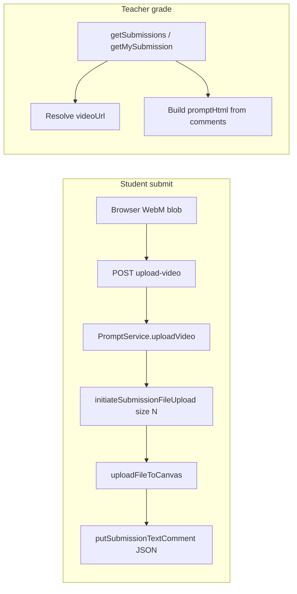

# Review: WebM `PROMPT_DATA` + parallel assignment comments

## Current flows (from codebase)

**Submission (recording → Canvas)**  
Browser POSTs multipart to [`POST /api/prompt/upload-video`](apps/api/src/prompt/prompt.controller.ts) (Multer writes to `TMP_UPLOAD_DIR` or buffer). [`PromptService.uploadVideo`](apps/api/src/prompt/prompt.service.ts) then:

1. Calls `initiateSubmissionFileUploadForUser(..., filename, video.size, 'video/webm')` — **byte size is part of the Canvas upload handshake**.
2. Streams bytes via `uploadFileToCanvas`.
3. After attach, writes the **JSON submission comment** (`fsaslKind`, `deckTimeline`, `durationSeconds`, `mediaStimulus`, `promptSnapshotHtml`, etc.).

**Grading / viewer prompt resolution**  
[`getSubmissions`](apps/api/src/prompt/prompt.service.ts) (teacher list) and [`getMySubmission`](apps/api/src/prompt/prompt.service.ts) (student) build `promptHtml` from **submission comments** and body — not from the video file today. `videoUrl` comes from `getVideoUrlFromCanvasSubmission` or deep-link token → often rewritten to [`/api/prompt/video-proxy`](apps/api/src/prompt/prompt.controller.ts).

---

## Bridge Debug Log — focus on commit + WebM only (new)

**Goal while validating WebM work:** the Bridge panel should emphasize **only**:

1. **Deploy / commit context** — what operators already get from the “Build Fingerprint” block ([`BridgeLog.tsx`](apps/web/src/components/BridgeLog.tsx) + [`GET /api/debug/version`](apps/api/src/debug/debug.controller.ts)): web/api SHA, branch, `nodeEnv` / git fields so you know **which commit** is running.
2. **WebM `PROMPT_DATA`** — **write** path (ffmpeg mux after receive, before Canvas upload) and **read** path (ffprobe when flag on), each with explicit **success** and **failure** lines (timeout, spawn error, missing tag, parse error, fallback used).

**Do not delete** existing `appendLtiLog` / client `appendBridgeLog` usage across the codebase.

**Preferred approach (better than mass comment-out):**

- Add a **single API env flag**, e.g. `BRIDGE_LOG_FOCUS_WEBM=1` (default unset / off).
- Implement **one choke point** in [`appendLtiLog`](apps/api/src/common/last-error.store.ts) (or the smallest wrapper used everywhere): when focus mode is **on**, **only append** lines whose **tag** is in an allowlist (e.g. `webm-prompt`, and optionally `debug` for ping) **or** whose message is tagged for the fingerprint pipeline if you choose to route “commit” lines through a dedicated tag instead of the UI-only block.
- All new WebM-related messages use a **dedicated tag** consistently, e.g. `appendLtiLog('webm-prompt', 'write: OK …')` / `appendLtiLog('webm-prompt', 'write: FAIL …')` / `read: OK` / `read: FAIL`.
- **Why not comment out dozens of call sites:** high merge-conflict risk, easy to ship with logging accidentally disabled, and painful to revert. Env-gated suppression keeps full history in git and restores full Bridge noise by **unsettling one variable**.

**Optional (only if a few hotspots are still too chatty):** wrap a handful of especially noisy paths in `if (!process.env.BRIDGE_LOG_FOCUS_WEBM) appendLtiLog(...)` — still better than commenting blocks.

**Bridge UI ([`BridgeLog.tsx`](apps/web/src/components/BridgeLog.tsx)):** when focus mode is active, either (a) rely on server log already filtered so the green panel only shows allowed lines + existing fingerprint **section** built client-side, or (b) add a matching client-side filter for `readBridgeClientFallbackLines` merge — keep behavior consistent with API filter.

**Document in `.env.example`:** `BRIDGE_LOG_FOCUS_WEBM`, `USE_WEBM_METADATA_FOR_PROMPT`, and that focus mode is **temporary** for WebM validation.

---

## Verdict on your plan

**Strong fit:** Parallel storage, feature flag default off, fail-open philosophy, validation logging, and not deleting assignment-based logic are all sound.

**Must adjust / clarify**

1. **Where “before upload” runs**  
   Metadata must be applied on the **API** after the file is received, **before** step `initiateSubmissionFileUploadForUser`, using a **muxed output file** (temp path). On success, pass **the muxed file + its byte length** into Canvas; on failure, use the original file and original size.  
   *Reason:* Canvas upload is sized up front ([`prompt.service.ts` around 2563–2571](apps/api/src/prompt/prompt.service.ts)); remux can change file size.

2. **“Non-blocking” vs “never delay submission”**  
   You cannot both **embed metadata in the bytes Canvas receives** and run ffmpeg **completely asynchronously after upload starts**.  
   **Better definition:** **bounded, fail-open** — e.g. `await` `ffmpeg -c copy -metadata PROMPT_DATA=...` with a **wall-clock timeout**; on timeout/error, log and continue with the **original** WebM. That adds a small latency on the happy path (usually acceptable with `-c copy`) but never fails the submit.

3. **`PROMPT_DATA` JSON = “same as comment”**  
   The post-upload comment is a **structured object** (`fsaslKind`, `deckTimeline`, `durationSeconds`, `mediaStimulus`, `promptSnapshotHtml`, …). For `PROMPT_MATCH`, define a **canonical JSON** (stable key order or normalize before compare) so “metadata vs comment” comparison is deterministic. Optionally store **exactly** the same string you would put in the comment (minus nothing) to avoid drift.

4. **Phase 2: ffprobe is not “after video URL in browser”**  
   The teacher UI uses proxied URLs; **ffprobe should run on the API** when building `getSubmissions` / `getMySubmission` (or a shared helper they both call).  
   **Likely implementation:** download a **bounded prefix** or full file from Canvas using the **existing token** (same patterns as `video-proxy` / Canvas fetches) → temp file → `ffprobe -print_format json -show_format` → read `format.tags.PROMPT_DATA`.  
   Spike whether signed Canvas URLs allow `ffprobe` directly on HTTPS without extra headers; if not, **temp download** is the reliable path.

5. **Scope gap: other upload paths**  
   If [`submit-deep-link`](apps/web/src/api/prompt.api.ts) or any path uploads video **without** going through `PromptService.uploadVideo`, Phase 1 would not cover it until explicitly wired. Call out in implementation checklist.

6. **“Env without deployment” on Render**  
   Changing env vars typically **restarts** the service (no code deploy, but not zero-downtime instant flip inside one process). Acceptable for most teams; if you need true hot-toggle, that’s a separate small runtime-config feature.

7. **Goal line about “student only sees video, rubric, feedback”**  
   That is mostly **UI / routing** work on [`TeacherViewerPage`](apps/web/src/pages/TeacherViewerPage.tsx) / student viewer — **orthogonal** to WebM metadata. Keeping metadata as “prompt source of truth” support is fine; don’t conflate the two in one PR unless you intend both.

---

## Suggested testing gates (add to yours)

- After ffmpeg success, **Canvas-reported attachment size** (or local stat) matches **initiated** upload size (catches size mismatch bugs).
- **Idempotent replay** path for `upload-video`: replay returns same outcome without requiring ffmpeg again (or document that replay skips re-mux — intentional).
- **Large file / slow disk:** timeout path exercised so submit still completes.
- **Bridge focus mode:** with `BRIDGE_LOG_FOCUS_WEBM=1`, Bridge shows fingerprint + `webm-prompt` success/fail only; with flag off, prior verbosity returns without code revert.

---

## Summary

Your plan is **directionally right** and maps cleanly to [`PromptService.uploadVideo`](apps/api/src/prompt/prompt.service.ts) + [`getSubmissions`](apps/api/src/prompt/prompt.service.ts) / [`getMySubmission`](apps/api/src/prompt/prompt.service.ts). Tighten wording around **non-blocking** (fail-open + bounded wait + correct file size), and plan **API-side** download/ffprobe for Phase 2. For Bridge: **env-gated allowlist** + **`webm-prompt` tag** with explicit success/fail lines; **avoid** mass comment-out of existing logging.
