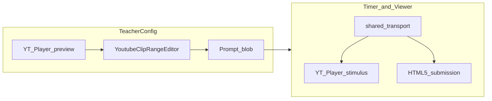

# YouTube workflow enhancements (binding constraints)

Instructions below are **constraints**, not suggestions.

## Current baseline

- **Teacher config**: [`TeacherConfigPage.tsx`](apps/web/src/pages/TeacherConfigPage.tsx); embed via [`youtube-embed.ts`](apps/web/src/utils/youtube-embed.ts).
- **Persisted**: [`YoutubePromptConfig`](apps/web/src/api/prompt.api.ts); server [`prompt.service.ts`](apps/api/src/prompt/prompt.service.ts).
- **Recording**: [`TimerPage.tsx`](apps/web/src/pages/TimerPage.tsx) concurrent stimulus + camera.
- **Grading / viewer**: [`TeacherViewerPage.tsx`](apps/web/src/pages/TeacherViewerPage.tsx); [`GradingVideoPlayer.tsx`](apps/web/src/components/GradingVideoPlayer.tsx).

---

## 1) Clip handles — `YoutubeClipRangeEditor`

- **Custom component only:** Build a **dual-thumb range** from scratch (overlapping elements, **or** canvas, **or** SVG track). **Do not** add any **third-party range-slider** libraries.
- **Numeric inputs:** Existing start/end **number inputs must remain** and stay **fully synchronized with the handles in both directions** (handles → inputs, inputs → handles). They are the accessibility and power-user fallback.
- **Clamping:** On every interaction, clamp both handles to **`[0, getDuration()]`** from the preview `YT.Player`. Also enforce the existing server-side **max span** (24h window) when persisting.
- **IFrame API failure (teacher config only):** If the YouTube IFrame API **fails to load**, render **numeric inputs only** with a **visible warning**. **Do not** block the teacher from **saving** configuration.

---

## 2) Subtitle mask

- **Shape:** Bottom-anchored bar; **not** vertically draggable — fixed bottom anchor; **height** adjustable **only** in teacher configuration.
- **Persistence:** `subtitleMask: { enabled: boolean; heightPercent: number }` on `youtubePromptConfig` (or as agreed nested field).
- **Defaults:** `enabled: false`, `heightPercent: 15`.
- **Server:** Clamp `heightPercent` to **`[5, 30]`** in [`putConfig`](apps/api/src/prompt/prompt.service.ts) / DTO validation.
- **CSS:** `position: absolute`, `bottom: 0`, `width: 100%`, `pointer-events: none`, **`background: #000`** (**opaque**, not semi-transparent) so burned-in subtitles are fully covered.
- **Layout:** Wrap **every** stimulus player area in the **same** `position: relative` container on [`TeacherConfigPage`](apps/web/src/pages/TeacherConfigPage.tsx), [`TimerPage`](apps/web/src/pages/TimerPage.tsx), and [`TeacherViewerPage`](apps/web/src/pages/TeacherViewerPage.tsx) so the mask is visually consistent.
- **Permissions:** **Height / enable controls** only in **teacher config**. Students and grading viewer **see** the mask as configured; **no** mask controls there.

---

## 3) Caption control

**Lead requirement (from spec):** **Replace every interactive stimulus** that uses a raw `<iframe src=…>` for playback with a **`YT.Player`**-driven surface so caption visibility is under app control, not YouTube’s default chrome.

- **`playerVars`:** e.g. **`controls: 0`**, **`modestbranding: 1`**, and caption defaults via API / params as appropriate—**no** reliance on students using the in-frame CC button for policy.
- **Persist `allowStudentCaptions`** (default **`false`**). When false: **no** student-facing “turn on captions” control; keep captions off via API. When true: **one** app control toggles captions **only** through the IFrame API.
- **Teachers:** **Teacher-only** toggle to show captions on the stimulus for grading (independent of student policy).
- **Submission audio:** In-app hint for **OS/browser Live Caption** on the **student `<video>`** for teachers who need transcription of voicing (YouTube API does not apply there).

**Config vs runtime:** The **clip editor** API failure policy (**§1**) allows save with numeric-only UI. **Runtime** stimulus (Timer / viewer) still **requires** a working controlled player for caption policy; if IFrame API is unavailable at runtime, show a **clear error** for that surface (do not fall back to an uncontrolled embed for students).

**Note:** `buildYoutubeNocookieEmbedSrc` may remain for non-interactive cases only; interactive flows use the shared player wrapper.

---

## 4) Side-by-side synced review + playback speed

- **Layout:** Two columns (stack on narrow): stimulus (`YT.Player`) + [`GradingVideoPlayer`](apps/web/src/components/GradingVideoPlayer.tsx) / `<video>`.
- **Sync:** Submission timeline is **master**; stimulus seeks to `clipStartSec + clamp(t, 0, clipWall)`; past clip end, hold/pause stimulus per prior plan.
- **Single transport:** One scrubber / play / pause / rate drives both; YouTube `setPlaybackRate` aligned with supported rates.

---

## 5) API / types

- Extend [`prompt.api.ts`](apps/web/src/api/prompt.api.ts), [`prompt-config.dto.ts`](apps/api/src/prompt/dto/prompt-config.dto.ts), [`prompt.service.ts`](apps/api/src/prompt/prompt.service.ts) for `subtitleMask`, `allowStudentCaptions`, and validation.

---

## 6) Testing checklist

- Clip handles: drag + numeric bidirectional sync; duration clamp; 24h span; API fail in config → warning + save OK.
- Mask: defaults; server clamp; opaque bar; same wrapper on all three pages; no student/grading height controls.
- Captions: no raw interactive iframe; student policy enforced; teacher toggle works; runtime no silent uncontrolled fallback (except §1 config editor).
- Synced dual player: scrub/rate; stimulus stops at clip end while submission continues.

