# Announcement-Based Flashcard Settings Architecture

## Step 1: Existing Codebase Report

**Canvas announcement API calls:** None. No references to `announcement`, `discussion_topics`, or `discussionTopic` exist in the codebase. The Canvas API will be used for the first time for announcements.

**Token/store state:**

- No `courseTokenStore` or server-side token Map exists
- `CANVAS_API_TOKEN` and `CANVAS_ACCESS_TOKEN` were removed from [.env](c:\dev\FlowStateASL.env); [.env.example](c:\dev\FlowStateASL.env.example) has no CANVAS_API_TOKEN
- Remaining mentions are in error message strings only: [submission.service.ts](apps/api/src/submission/submission.service.ts) L231, [FlashcardsPage.tsx](apps/web/src/pages/FlashcardsPage.tsx) L523, [README.md](README.md), and legacy PHP files (ASLexpressPromptManager, ASLexpressFlashcards)
- OAuth uses `session.canvasAccessToken`; Canvas calls use `options.canvasAccessToken` passed from controllers

---

## Step 2: OAuth for All Users

**File:** [apps/api/src/lti/lti.controller.ts](apps/api/src/lti/lti.controller.ts)

**Current (line 301):**

```ts
const needsOAuth = isTeacher && !(req.session as { canvasAccessToken?: string })?.canvasAccessToken;
```

**Change:** Trigger OAuth for any user without a valid token (remove `isTeacher` guard):

```ts
const needsOAuth = !(req.session as { canvasAccessToken?: string })?.canvasAccessToken;
```

Keep redirect to `/flashcards` or `/prompter` based on `ctx.toolType` (already in place via `finalRedirect`). Keep existing 401 → redirect logic in [course-settings.controller.ts](apps/api/src/course-settings/course-settings.controller.ts) and [TeacherSettings.tsx](apps/web/src/components/TeacherSettings.tsx); extend 401 handling to student-hub if needed (see Step 5).

---

## Step 3: Canvas Announcement API

**Approach:** Add methods to existing [CanvasService](apps/api/src/canvas/canvas.service.ts) to avoid extra modules. Canvas uses `discussion_topics` with `is_announcement: true` and `only_announcements=true` for announcements.

**Constants:**

```ts
const FLASHCARD_SETTINGS_ANNOUNCEMENT_TITLE = 'ASL Express Flashcard Settings';
const FLASHCARD_SETTINGS_ANNOUNCEMENT_TITLE_FULL = '⚠️ DO NOT DELETE — ASL Express Flashcard Settings';
```

**New methods:**

1. `**findFlashcardSettingsAnnouncement(courseId, tokenOverride, domainOverride)`**
  - `GET /api/v1/courses/{courseId}/discussion_topics?only_announcements=true&per_page=100`
  - Paginate and find topic whose `title` includes "ASL Express Flashcard Settings"
  - Return `{ id, title, message } | null`
2. `**createFlashcardSettingsAnnouncement(courseId, settings, tokenOverride, domainOverride)**`
  - `POST /api/v1/courses/{courseId}/discussion_topics`
  - Body: `{ title: FLASHCARD_SETTINGS_ANNOUNCEMENT_TITLE_FULL, message: JSON.stringify(settings), is_announcement: true }`
  - Return created topic id
3. `**updateFlashcardSettingsAnnouncement(courseId, topicId, settings, tokenOverride, domainOverride)**`
  - `PUT /api/v1/courses/{courseId}/discussion_topics/{topicId}`
  - Body: `{ message: JSON.stringify(settings) }`
4. `**readFlashcardSettingsAnnouncement(courseId, tokenOverride, domainOverride)**`
  - Call `findFlashcardSettingsAnnouncement`, then parse `message` as JSON
  - Extract `selectedCurriculums`, `selectedUnits`; return object or null
  - Handle Canvas HTML-wrapping in message (similar to `parseAssignmentDescription` in course-settings.service)

Reuse existing `getAuthHeaders`, `getBaseUrl`, and 401 handling patterns from CanvasService.

---

## Step 4: Teacher Save — Dual Write

**File:** [apps/api/src/course-settings/course-settings.service.ts](apps/api/src/course-settings/course-settings.service.ts)

**Method:** `save()`

**Current behavior:** Writes to Flashcard Settings assignment only (lines 306–326).

**Add after assignment write (keep assignment write as-is):**

1. Build payload: `{ v: 1, selectedCurriculums, selectedUnits, updatedAt }`
2. Call `this.canvas.findFlashcardSettingsAnnouncement(courseId, effectiveToken, canvasOverride)`
3. If found → `this.canvas.updateFlashcardSettingsAnnouncement(courseId, id, payload, ...)`
4. If not found → `this.canvas.createFlashcardSettingsAnnouncement(courseId, payload, ...)`
5. On announcement API failure, log but do not fail the save (assignment is backup)

---

## Step 5: Student Read — Announcement First

**Files:**  

- [apps/api/src/course-settings/course-settings.service.ts](apps/api/src/course-settings/course-settings.service.ts)  
- [apps/api/src/flashcard/flashcard.service.ts](apps/api/src/flashcard/flashcard.service.ts)  
- [apps/api/src/flashcard/flashcard.controller.ts](apps/api/src/flashcard/flashcard.controller.ts)

**Option A (recommended):** Introduce a branch inside `CourseSettingsService.get()` based on `isTeacher`:

- **Teacher:** Use assignment path (current logic, assignment only)
- **Student:** Call `readFlashcardSettingsAnnouncement(courseId, options.canvasAccessToken, ...)`; pass `canvasAccessToken` from session in student-hub flow

**Student flow changes:**

- [flashcard.controller.ts](apps/api/src/flashcard/flashcard.controller.ts): Pass `canvasAccessToken: (req.session as { canvasAccessToken?: string })?.canvasAccessToken` into `getStudentHub`, `getStudentUnits`, `getStudentSections`, `getStudentPlaylists`
- [flashcard.service.ts](apps/api/src/flashcard/flashcard.service.ts): `getStudentConstraints` calls `courseSettings.get(courseId, { isTeacher: false, canvasDomain, canvasBaseUrl, canvasAccessToken })`
- [course-settings.service.ts](apps/api/src/course-settings/course-settings.service.ts): When `isTeacher === false`:
  1. Use `options.canvasAccessToken` and `readFlashcardSettingsAnnouncement`
  2. If found → return `{ selectedCurriculums, selectedUnits, ... }`
  3. If not found or error → return `{ selectedCurriculums: [], selectedUnits: [], error: 'announcement_missing' }`
  4. Propagate 401 via `CanvasTokenExpiredError`; controller returns 401 with `redirectToOAuth: true`

**Option B:** Add `getForStudent()` that uses announcement only. `getStudentConstraints` would call `getForStudent()` instead of `get()`. Keeps `get()` teacher-only and adds a clear student path.

**Recommendation:** Use Option A (single `get()` with `isTeacher` branch) to avoid duplication.

**Frontend:** [apps/web/src/pages/FlashcardsPage.tsx](apps/web/src/pages/FlashcardsPage.tsx)

- In `loadHubData`, after parsing hub response, if `hub?.error === 'announcement_missing'`:
  - Set `setDeckLoadError('Course materials are not yet configured. Please notify your teacher.')` or equivalent
  - Render message in student view instead of empty unit list

---

## Step 6: Teacher Modal — Recreate Missing Announcement

**File:** [apps/web/src/components/TeacherSettings.tsx](apps/web/src/components/TeacherSettings.tsx)

**Approach:**

- Add state: `announcementMissing: boolean`, `showRecreateAnnouncementModal: boolean`
- Add endpoint: `GET /api/course-settings/announcement-status` returning `{ exists: boolean }` (teacher token; calls `findFlashcardSettingsAnnouncement`)
- On TeacherSettings load (in same effect as course-settings fetch):
  - If teacher and course-settings load succeeds, call announcement-status
  - If `exists === false` → set `announcementMissing: true`, `showRecreateAnnouncementModal: true`
- Modal: "The ASL Express Flashcard Settings announcement was deleted or is missing. Would you like to recreate it?"
- On confirm: call `POST /api/course-settings/recreate-announcement`:
  - Reads settings from Flashcard Settings assignment (backup)
  - Creates announcement with that data
  - Returns success
- Backend: Add `recreateAnnouncement(courseId, token, canvasBaseUrl)` in CourseSettingsService; controller endpoint for teachers only

---

## Step 7: Remove Server-Side Token Store and Env Tokens

**Findings:**

- No in-memory `courseTokenStore` or similar exists
- [.env.example](c:\dev\FlowStateASL.env.example) no longer has CANVAS_API_TOKEN or CANVAS_ACCESS_TOKEN
- References to remove or update:
  - [submission.service.ts](apps/api/src/submission/submission.service.ts) L231: Change error message to omit "CANVAS_API_TOKEN" (e.g. "Configure Canvas OAuth in Teacher Settings")
  - [FlashcardsPage.tsx](apps/web/src/pages/FlashcardsPage.tsx) L523: Same
  - [README.md](README.md): Remove CANVAS_API_TOKEN from setup instructions
  - PHP/legacy files in ASLexpressPromptManager, ASLexpressFlashcards: Out of scope (separate apps)

---

## Data Flow (Mermaid)

```mermaid
flowchart TB
  subgraph TeacherSave [Teacher Saves]
    T1[PUT /api/course-settings]
    T2[CourseSettingsService.save]
    T3[Write Flashcard Settings Assignment]
    T4[Find Announcement]
    T5{Announcement Exists?}
    T6[Update Announcement]
    T7[Create Announcement]
    T1 --> T2 --> T3
    T2 --> T4 --> T5
    T5 -->|yes| T6
    T5 -->|no| T7
  end

  subgraph StudentRead [Student Reads]
    S1[LTI Launch]
    S2{OAuth Token?}
    S3[Redirect to OAuth]
    S4[student-hub]
    S5[readFlashcardSettingsAnnouncement]
    S6{Found?}
    S7[Return settings]
    S8[Return announcement_missing]
    S1 --> S2
    S2 -->|no| S3 --> S4
    S2 -->|yes| S4
    S4 --> S5 --> S6
    S6 -->|yes| S7
    S6 -->|no| S8
  end

  subgraph TeacherRecreate [Teacher Recreate]
    R1[Modal: Announcement Missing]
    R2[Teacher Confirms]
    R3[Read Assignment Backup]
    R4[Create Announcement]
    R1 --> R2 --> R3 --> R4
  end
```




---

## Files to Modify


| File                                                                                        | Changes                                                                    |
| ------------------------------------------------------------------------------------------- | -------------------------------------------------------------------------- |
| [lti.controller.ts](apps/api/src/lti/lti.controller.ts)                                     | OAuth for all users (remove `isTeacher` from `needsOAuth`)                 |
| [canvas.service.ts](apps/api/src/canvas/canvas.service.ts)                                  | Add 4 announcement methods                                                 |
| [course-settings.service.ts](apps/api/src/course-settings/course-settings.service.ts)       | Teacher: dual write on save; Student: use announcement in get              |
| [course-settings.controller.ts](apps/api/src/course-settings/course-settings.controller.ts) | Add `announcement-status`, `recreate-announcement` endpoints               |
| [flashcard.controller.ts](apps/api/src/flashcard/flashcard.controller.ts)                   | Pass `canvasAccessToken` from session to student-hub and related endpoints |
| [flashcard.service.ts](apps/api/src/flashcard/flashcard.service.ts)                         | Pass `canvasAccessToken` into getStudentConstraints                        |
| [FlashcardsPage.tsx](apps/web/src/pages/FlashcardsPage.tsx)                                 | Handle `error: announcement_missing`; update error copy                    |
| [TeacherSettings.tsx](apps/web/src/components/TeacherSettings.tsx)                          | Announcement-status check; recreate modal and confirm flow                 |
| [submission.service.ts](apps/api/src/submission/submission.service.ts)                      | Update error message (no CANVAS_API_TOKEN)                                 |
| [README.md](README.md)                                                                      | Update setup (no CANVAS_API_TOKEN)                                         |


---

## Out of Scope (Do Not Change)

- `findAssignmentByTitle`, `getAssignment` logic
- Flashcard Settings assignment write logic
- SproutVideo and playlist logic
- Student-hub flow architecture (only source of settings changes)

