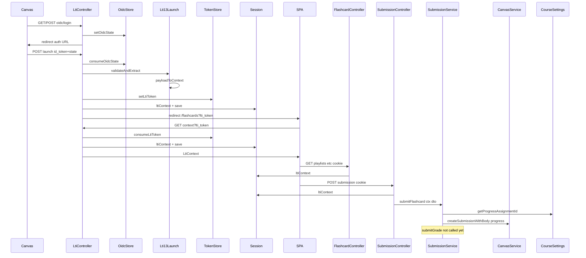

# LTI 1.3 Flow Analysis and Proposed Shared Helper Structure

Analysis of the complete LTI 1.3 flow in the Flashcards implementation from launch to grade passback, with per-step classification (purpose, file, tool-specific vs shared, generalization needs) and a proposed shared helper structure (extractions, names, locations) without writing code.

## End-to-end flow (launch to grade passback)

---

## Step-by-step analysis

### Phase 1: OIDC login (Canvas to our app)

| Step                                                            | What it does                                                                                         | File                                                                                       | Tool-specific? | Generalization               |
| --------------------------------------------------------------- | ---------------------------------------------------------------------------------------------------- | ------------------------------------------------------------------------------------------ | -------------- | ---------------------------- |
| Parse OIDC params (iss, login_hint, target_link_uri, client_id) | Reads query/body and normalizes param names                                                          | [apps/api/src/lti/lti.controller.ts](apps/api/src/lti/lti.controller.ts) `handleOidcLogin` | No             | None. Already tool-agnostic. |
| Validate required params, return 400 if missing                 | Checks iss, login_hint, target_link_uri, client_id, LTI_REDIRECT_URI                                 | Same                                                                                       | No             | None.                        |
| Generate state + nonce, store in OIDC store                     | `setOidcState(state, nonce, redirectUri, targetLinkUri)`                                             | [apps/api/src/lti/lti-oidc-state.store.ts](apps/api/src/lti/lti-oidc-state.store.ts)       | No             | None.                        |
| Build Canvas auth URL and redirect                              | URL on iss with scope, response_type, client_id, redirect_uri, state, nonce, response_mode=form_post | [apps/api/src/lti/lti.controller.ts](apps/api/src/lti/lti.controller.ts) `handleOidcLogin` | No             | None.                        |

### Phase 2: Launch (Canvas POST id_token + state)

| Step                                          | What it does                                                                                                                   | File                                                                                                      | Tool-specific? | Generalization                                                                                                                               |
| --------------------------------------------- | ------------------------------------------------------------------------------------------------------------------------------ | --------------------------------------------------------------------------------------------------------- | -------------- | -------------------------------------------------------------------------------------------------------------------------------------------- |
| Handle Canvas error/error_description in body | Returns 400 HTML error page                                                                                                    | [apps/api/src/lti/lti.controller.ts](apps/api/src/lti/lti.controller.ts) `launch13`                       | Partially      | `ltiErrorHtml` links to `/flashcards?debug=1`; should use a generic path or config (e.g. FRONTEND_URL only).                                 |
| Extract id_token and state, validate presence | 400 if missing                                                                                                                 | Same                                                                                                      | No             | None.                                                                                                                                        |
| Consume OIDC state                            | `consumeOidcState(state)`                                                                                                      | [apps/api/src/lti/lti-oidc-state.store.ts](apps/api/src/lti/lti-oidc-state.store.ts)                      | No             | None.                                                                                                                                        |
| Validate JWT and extract payload              | Fetches platform JWKS from iss, verifies signature/iss/aud/exp, optional dev fallback for small keys                           | [apps/api/src/lti/lti13-launch.service.ts](apps/api/src/lti/lti13-launch.service.ts) `validateAndExtract` | No             | None.                                                                                                                                        |
| Map JWT payload to LtiContext                 | Reads LTI claim URIs + custom (course_id, assignment_id, user_id, module_id, roles, tool_type); derives canvasBaseUrl from iss | [apps/api/src/lti/lti13-launch.service.ts](apps/api/src/lti/lti13-launch.service.ts) `payloadToContext`   | Partially      | Only tool-specific: `toolType = custom.tool_type === 'prompter' ? 'prompter' : 'flashcards'`. Could accept a mapping or default from config. |
| Optional: teacher prompter assignment sync    | If toolType===prompter and teacher, sync assignment name                                                                       | [apps/api/src/lti/lti.controller.ts](apps/api/src/lti/lti.controller.ts) `launch13`                       | Yes (Prompter) | Keep in controller as tool-specific post-step; no extraction.                                                                                |
| Create one-time token, store context          | `setLtiToken(token, ctx)`                                                                                                      | [apps/api/src/lti/lti-token.store.ts](apps/api/src/lti/lti-token.store.ts)                                | No             | None.                                                                                                                                        |
| Choose redirect path by toolType              | `path = ctx.toolType === 'prompter' ? '/prompter' : '/flashcards'`                                                             | [apps/api/src/lti/lti.controller.ts](apps/api/src/lti/lti.controller.ts) `launch13`                       | Yes            | Path should come from a small registry: toolType to SPA path (e.g. config or constant map).                                                  |
| OAuth redirect decision                       | If no session canvas token and OAuth configured, redirect to /api/oauth/canvas?returnTo=finalRedirect                          | Same                                                                                                      | No             | None.                                                                                                                                        |
| Save ltiContext to session, redirect          | session.save then res.redirect(finalRedirect or OAuth URL)                                                                     | Same                                                                                                      | No             | None.                                                                                                                                        |

### Phase 3: Context for SPA (first load with lti_token)

| Step                                        | What it does                                                                 | File                                                                                  | Tool-specific? | Generalization                                                                                |
| ------------------------------------------- | ---------------------------------------------------------------------------- | ------------------------------------------------------------------------------------- | -------------- | --------------------------------------------------------------------------------------------- |
| Return context from session if present      | Read req.session.ltiContext                                                  | [apps/api/src/lti/lti.controller.ts](apps/api/src/lti/lti.controller.ts) `getContext` | No             | None.                                                                                         |
| Else consume lti_token and return context   | consumeLtiToken(token), optionally write to session, return context          | Same                                                                                  | No             | None.                                                                                         |
| Fallback when no session and no valid token | Return minimal standalone context (toolType: flashcards, userId: standalone) | Same                                                                                  | Partially      | Default toolType is hardcoded flashcards; could be config or leave as-is for unauthenticated. |

### Phase 4: Protected API calls (Flashcards)

| Step                                                                | What it does                                                                          | File                                                                                                 | Tool-specific?                                              | Generalization                                                                                                                  |
| ------------------------------------------------------------------- | ------------------------------------------------------------------------------------- | ---------------------------------------------------------------------------------------------------- | ----------------------------------------------------------- | ------------------------------------------------------------------------------------------------------------------------------- |
| Guard: require session.ltiContext                                   | LtiLaunchGuard canActivate                                                            | [apps/api/src/lti/guards/lti-launch.guard.ts](apps/api/src/lti/guards/lti-launch.guard.ts)           | No                                                          | None.                                                                                                                           |
| Read ctx from session for flashcard playlists/items/config/progress | req.session.ltiContext (and canvasAccessToken)                                        | [apps/api/src/flashcard/flashcard.controller.ts](apps/api/src/flashcard/flashcard.controller.ts)     | No (context is shared)                                      | None. Flashcard-specific is the use of ctx (e.g. getConfig by courseId+resourceLinkId).                                         |
| POST submission: build full ctx and call submitFlashcard            | session ltiContext + canvasAccessToken to SubmissionService.submitFlashcard(ctx, dto) | [apps/api/src/submission/submission.controller.ts](apps/api/src/submission/submission.controller.ts) | Controller is shared; service method is Flashcards-specific | Submission controller could stay generic; different tools would call different service methods or a dispatcher by ctx.toolType. |

### Phase 5: Submission and grade passback (Flashcards)

| Step                                    | What it does                                                                          | File                                                                                                                  | Tool-specific?                                                                        | Generalization                                                                                                                                                                     |
| --------------------------------------- | ------------------------------------------------------------------------------------- | --------------------------------------------------------------------------------------------------------------------- | ------------------------------------------------------------------------------------- | ---------------------------------------------------------------------------------------------------------------------------------------------------------------------------------- |
| calculateGrade(dto)                     | Tutorial to 0 / not graded; else percentage                                           | [apps/api/src/submission/submission.service.ts](apps/api/src/submission/submission.service.ts)                        | Flashcards-specific (tutorial vs rehearsal/screening)                                 | Any tool would have its own grading rules; could be a strategy or tool-specific service.                                                                                           |
| Resolve progress assignment for course  | getProgressAssignmentId (Flashcard Progress assignment)                               | [apps/api/src/course-settings/course-settings.service.ts](apps/api/src/course-settings/course-settings.service.ts)    | Flashcards-specific (assignment title and schema)                                     | Prompter would use different assignment or no progress assignment; keep in course-settings or tool-specific config.                                                                |
| Save progress to Canvas submission body | getSubmission, merge JSON results, createSubmissionWithBody                           | [apps/api/src/submission/submission.service.ts](apps/api/src/submission/submission.service.ts) `saveProgressToCanvas` | Flashcards-specific (schema: results by deckId, mergeDeckResult, parseSubmissionBody) | Progress schema and merge logic are tool-specific; only the get token, get/create assignment, GET submission, POST body pattern could be shared.                                   |
| LTI 1.1 grade passback                  | CanvasService.submitGrade(outcomeUrl, sourcedid, score, scoreTotal) XML replaceResult | [apps/api/src/canvas/canvas.service.ts](apps/api/src/canvas/canvas.service.ts)                                        | No (generic LTI Outcomes)                                                             | None. Not currently called from SubmissionService (stubbed). Would need ctx.lisOutcomeServiceUrl and ctx.lisResultSourcedid (LTI 1.1 only; Lti13LaunchService does not set these). |

---

## Proposed shared helper structure

### 1. LTI error HTML (generalize link)

- **Current:** [apps/api/src/lti/lti.controller.ts](apps/api/src/lti/lti.controller.ts) — `ltiErrorHtml(message, frontendUrl)`; debug link is `${frontendUrl}/flashcards?debug=1`.
- **Proposal:** Extract to a small helper used by LtiController. Either:
  - **Option A:** Move to `apps/api/src/lti/lti-error.util.ts` (or `lti-html.util.ts`) and pass a debug path argument (e.g. `/flashcards` or a generic `/` or from config). Name: `renderLtiLaunchErrorHtml(message: string, options?: { frontendUrl?: string; debugPath?: string })`.
  - **Option B:** Keep in controller but use `frontendUrl` only for the link (e.g. `${frontendUrl}?debug=1`) so the link is not Flashcards-specific.
- **Location:** New file under `apps/api/src/lti/` (e.g. `lti-error.util.ts`) if extracted; otherwise same file with a one-line change.

### 2. Redirect path by tool type

- **Current:** Inline in `launch13`: `const path = ctx.toolType === 'prompter' ? '/prompter' : '/flashcards'`.
- **Proposal:** Extract to a single place so adding a new tool is one edit. Options:
  - **Option A:** Constant map in lti.controller.ts or in a small module: `TOOL_TYPE_TO_SPA_PATH: Record<LtiContext['toolType'], string>` (e.g. `{ flashcards: '/flashcards', prompter: '/prompter' }`). Controller calls `getRedirectPathForToolType(ctx.toolType)` or uses the map.
  - **Option B:** Config (e.g. env or ConfigService): LTI_SPA_PATHS_FLASHCARDS, LTI_SPA_PATHS_PROMPTER or a single JSON. Prefer a code constant unless you need runtime config.
- **Name:** `getRedirectPathForToolType(toolType: LtiContext['toolType']): string` or `TOOL_TYPE_SPA_PATHS`.
- **Location:** `apps/api/src/lti/lti-redirect.util.ts` (or next to LtiController). If you later add more LTI helpers, a single `apps/api/src/lti/lti.util.ts` or `lti/constants.ts` could hold this and the error helper.

### 3. Session + token + redirect after successful launch (LTI 1.3)

- **Current:** In `launch13`: create token, setLtiToken, set session.ltiContext, session.save callback, then either OAuth redirect or finalRedirect. Duplicated pattern also in launchFlashcards and launchPrompter (LTI 1.1) with small differences (sync step only for prompter).
- **Proposal:** Extract a small helper that: (1) generates token and calls setLtiToken(ctx), (2) assigns req.session.ltiContext = ctx, (3) calls session.save(callback), (4) in callback: decides redirect URL (OAuth init vs finalRedirect) and calls res.redirect(url). The helper does not know about flashcards vs prompter; it receives ctx and finalRedirect (already computed from toolType). So the only extraction is the persist context and redirect logic.
- **Name:** `persistLtiContextAndRedirect(req, res, ctx, finalRedirect, options?: { oauthInitUrl?: string })` or `finishLtiLaunch`. Responsibility: persist context (token + session), then redirect to finalRedirect or to oauthInitUrl when appropriate.
- **Location:** `apps/api/src/lti/lti-launch-finish.util.ts` (or inside a thin LtiLaunchHandler service used by LtiController). Controller would still: compute finalRedirect (using the path map above), compute oauthInitUrl when needed, then call this helper. Keeps controller as orchestrator; helper is reusable for any tool.

### 4. LTI 1.1 context extraction (already shared, minor default)

- **Current:** [apps/api/src/lti/lti.service.ts](apps/api/src/lti/lti.service.ts) `extractContext(body)` returns LtiContext with a hardcoded default `toolType: 'prompter'` (overwritten by controller for flashcards/prompter).
- **Proposal:** Make default explicit and tool-agnostic: e.g. `toolType: 'flashcards' as const` in the service so LTI 1.1 behavior is default to flashcards unless overwritten by launch endpoint. No extraction of the function; it already lives in LtiService and is used by both launch endpoints. Optional: accept an optional defaultToolType parameter if you want launch/flashcards and launch/prompter to pass it explicitly.

### 5. LTI 1.3 payload to context (tool type mapping)

- **Current:** [apps/api/src/lti/lti13-launch.service.ts](apps/api/src/lti/lti13-launch.service.ts) `payloadToContext` sets `toolType = custom.tool_type === 'prompter' ? 'prompter' : 'flashcards'`.
- **Proposal:** Keep mapping in one place. Optionally generalize to a small mapping (e.g. allowed custom values to toolType) so adding a new tool is a single addition: e.g. `CUSTOM_TOOL_TYPE_TO_TOOL_TYPE: Record<string, LtiContext['toolType']>` with default flashcards. No need to extract to another file unless you add many tools; same method, configurable map is enough.

### 6. Submission and grade passback: one function per operation, parameterized

Submission (writing to an assignment, sending a grade via AGS, submitting a result) is the same sequence of operations for both tools. The only difference is the **data** passed in: flashcard result vs prompt + video. That is solved with **parameters**, not separate functions or tool-specific implementations.

- **One function to find-or-create an assignment for a course.** It receives `ctx` and parameters such as assignment title and configuration (description, submission types, points possible, etc.). It looks up an assignment by name for the course; if it doesn't exist, it creates it and returns the ID. The operation is identical for both tools; only the assignment name and configuration differ. **Do not build a separate resolver for Prompt Manager** — both Flashcards and Prompter call this same function with their own assignment name/config as parameters.
- **One function to write a submission body to a Canvas assignment.** It receives `ctx`, `assignmentId`, and `bodyContent` (string). It does not know or care whether the content is a flashcard result or a prompt snapshot. Each tool: gets assignment ID (via the find-or-create function above with its name/config), builds its body (including any merge with existing, if the tool wants that), then calls this function with those values.
- **One function to send a grade via LTI 1.3 AGS.** It receives `ctx` and parameters such as `score`, `scoreMaximum`, and optional `resultContent` / `resultFormat`. It does not know or care how the score was calculated. Each tool: computes its score and optional result content, then calls this function with those values.
- **Submitting a result (URL or content)** is the same operation: the AGS function accepts optional result content as parameters. One implementation, different arguments.

What stays tool-specific is only **data and data preparation**: the assignment name/config passed to find-or-create, computing the score, and building the body string. The **operations** (find-or-create assignment, write body, send grade, send result) are shared; both tools call the same functions with different arguments.

- **AssessmentService.syncAssignmentNameIfNeeded** — Prompter-only; stays in controller.
- **LtiLaunchGuard**, **Token and OIDC stores** — Already shared; no change.

### 7. Suggested file layout (new/renamed files only)

- `apps/api/src/lti/lti-error.util.ts` — `renderLtiLaunchErrorHtml(message, options?)` (optional debug path).
- `apps/api/src/lti/lti-redirect.util.ts` (or `lti/constants.ts`) — `TOOL_TYPE_SPA_PATHS` and/or `getRedirectPathForToolType(toolType)`.
- `apps/api/src/lti/lti-launch-finish.util.ts` — `persistLtiContextAndRedirect(req, res, ctx, finalRedirect, options?)` to centralize token + session persist and redirect (and optional OAuth redirect).

Controller and Lti13LaunchService stay where they are; they call these helpers/constants so that tool-specific behavior (which path, which error link) is configured in one place and the rest is reusable by any tool.

---

## Summary: shared vs tool-specific

| Component                                               | Today                               | After proposal                                                         |
| ------------------------------------------------------- | ----------------------------------- | ---------------------------------------------------------------------- |
| OIDC login (handleOidcLogin)                            | Shared                              | Shared (no change)                                                     |
| OIDC state store                                        | Shared                              | Shared (no change)                                                     |
| JWT validateAndExtract / payloadToContext               | Shared (toolType from custom)       | Shared; optional map for tool_type to toolType                         |
| Token store                                             | Shared                              | Shared (no change)                                                     |
| Session + redirect after launch                         | Shared but inline                   | Shared helper persistLtiContextAndRedirect                             |
| Redirect path by toolType                               | Hardcoded in controller             | Shared getRedirectPathForToolType or TOOL_TYPE_SPA_PATHS               |
| LTI error HTML                                          | Link to /flashcards                 | Shared renderLtiLaunchErrorHtml with configurable debug path           |
| LtiLaunchGuard                                          | Shared                              | Shared (no change)                                                     |
| getContext (session/token/fallback)                     | Shared; fallback default flashcards | Shared; optional config for fallback toolType                          |
| Find-or-create assignment (e.g. getProgressAssignmentId) | Flashcards-only today                    | One shared ensureAssignmentForCourse(ctx, config); both tools pass their title/config; do not build separate Prompter resolver |
| Write submission body / send grade via AGS              | Mixed (logic in Flashcards, no AGS yet) | One shared function each; tools pass in their data (assignmentId, body, score, result) |
| submitGrade (Canvas LTI 1.1 Outcomes)                   | Generic, not wired                  | Replace with shared LTI 1.3 AGS function (same idea: one function, parameters)           |
| Teacher sync (syncAssignmentNameIfNeeded)               | Prompter                            | Remain Prompter-specific in controller                                 |

---

## Revision: Shared submission and LTI 1.3 AGS

**Principle:** The submission flow — writing to an assignment record, sending a grade via AGS, submitting a result — is the same sequence of operations for both Flashcards and Prompt Manager. The only difference is the **data** being passed in. That is solved with **parameters**, not separate functions or tool-specific implementations. **One shared function per operation, parameterized for the data that differs between tools.**

### One function per operation (parameterized)

**1. Find-or-create an assignment for a course**

- **One function** that receives `ctx` and parameters: assignment title and configuration (e.g. description, submission types, points possible, omit from final grade).
- It finds an existing assignment for the course by that title (or other key); if none exists, it creates one with the given config and returns the ID. Same Canvas API calls for both tools; only the title and config differ.
- **Each tool:** Calls this function with its own assignment name and config (e.g. Flashcards: "Flashcard Progress" and its description/options; Prompter: its submission assignment title and config). No separate implementation for Prompt Manager — one shared function, different parameters.

**2. Write a submission body to a Canvas assignment**

- **One function** that receives `ctx`, `assignmentId`, and `bodyContent` (string).
- It does not know or care whether the content is a flashcard result or a prompt snapshot. It resolves the token from context, calls Canvas REST (e.g. getSubmission if needed for "new attempt" semantics, then createSubmissionWithBody), and handles errors.
- **Each tool:** Resolves its assignment ID (e.g. Flashcards: "Flashcard Progress"; Prompter: submission assignment for the resource link). Builds the body string (including any merge with existing, in the tool's own code). Calls this function with `(ctx, assignmentId, bodyContent)`.

**3. Send a grade via LTI 1.3 AGS (and optionally a result)**

- **One function** that receives `ctx` and parameters such as `score`, `scoreMaximum`, and optional `resultContent` and `resultFormat` (e.g. `'url' | 'text'`).
- It does not know or care how the score was calculated. It obtains the AGS token, resolves the lineitem URL, POSTs the score (and optionally the result), and handles errors and response parsing.
- **Each tool:** Computes its score (e.g. Flashcards: percentage from calculateGrade; Prompter: complete/incomplete or rubric). Optionally builds result content (e.g. Prompter: submission URL). Calls this function with `(ctx, { score, scoreMaximum, resultContent?, resultFormat? })`.

**4. Submit a result (content URL or score)**

- Same operation as above: the AGS function's optional `resultContent` / `resultFormat` parameters cover "submit a result." One implementation, different arguments. No separate "submit result" function unless the platform API truly requires a different endpoint.

### What is shared vs what is tool-specific

- **Shared (one implementation):** Find-or-create assignment; write submission body (REST); send grade/result (AGS). Same token handling, request structure, error handling, response parsing for both tools.
- **Tool-specific (data only):** The assignment name and config passed to find-or-create; building the body string (schema and merge logic); computing the score; choosing optional result content. Each tool calls the shared functions with its own values. Do not build a separate resolver for the Prompt Manager — use the same find-or-create function with Prompter's assignment name/config.

### Proposed shared functions (signatures)

- **Find-or-create assignment:** e.g. `ensureAssignmentForCourse(ctx: LtiContext, config: { title: string; description?: string; submissionTypes?: string[]; pointsPossible?: number; omitFromFinalGrade?: boolean; ... }): Promise<string>`. Returns assignment ID. Location: e.g. `apps/api/src/canvas/` in the same shared service as submission. Both Flashcards and Prompter call it with their own title and config; no separate resolver for Prompt Manager.
- **Write submission body:** e.g. `writeSubmissionBody(ctx: LtiContext, assignmentId: string, bodyContent: string): Promise<void>`. Location: e.g. `apps/api/src/canvas/` or `apps/api/src/submission/` in a shared service. If a tool needs to merge with existing, the tool calls a shared `getSubmission(ctx, assignmentId)` (or the same service exposes it), merges in its own code, then calls `writeSubmissionBody` with the final string.
- **Send grade (and optional result) via AGS:** e.g. `submitGradeViaAgs(ctx: LtiContext, payload: { score: number; scoreMaximum?: number; resultContent?: string; resultFormat?: 'url' | 'text' }): Promise<void>`. Location: e.g. `apps/api/src/lti/lti-ags.service.ts`. One implementation; both tools call it with different arguments.

### Flashcards call site (after extraction)

- Get assignment ID: call **one shared function** `ensureAssignmentForCourse(ctx, { title: 'Flashcard Progress', description: '...', submissionTypes: ['online_text_entry'], ... })` — same find-or-create used by both tools; Flashcards just passes its title and config.
- Build body: e.g. get existing via shared `getSubmission(ctx, assignmentId)`, then `parseSubmissionBody` + `mergeDeckResult` + `JSON.stringify({ results })` in Flashcards code. Call **one shared function:** `writeSubmissionBody(ctx, assignmentId, bodyString)`.
- Compute score: `calculateGrade(dto)` in Flashcards code. If graded, call **one shared function:** `submitGradeViaAgs(ctx, { score: points, scoreMaximum: 100 })`.
- No callbacks, no tool-specific "handlers," no separate resolver. Same functions, different arguments.

### Prompt Manager call site (when built)

- Get assignment ID: call **one shared function** `ensureAssignmentForCourse(ctx, { title: '...', description: '...', ... })` with Prompter's assignment name and config. Do not build a separate resolver for the Prompt Manager — the same find-or-create function, different parameters.
- Build body: prompt snapshot + video URL + metadata (Prompter schema). Call **one shared function:** `writeSubmissionBody(ctx, assignmentId, bodyString)`.
- Compute score and optional result URL (Prompter logic). Call **one shared function:** `submitGradeViaAgs(ctx, { score: scoreValue, scoreMaximum: 1, resultContent: submissionUrl, resultFormat: 'url' })`.
- Same three shared functions as Flashcards (ensureAssignmentForCourse, writeSubmissionBody, submitGradeViaAgs); only the data passed in is different.
